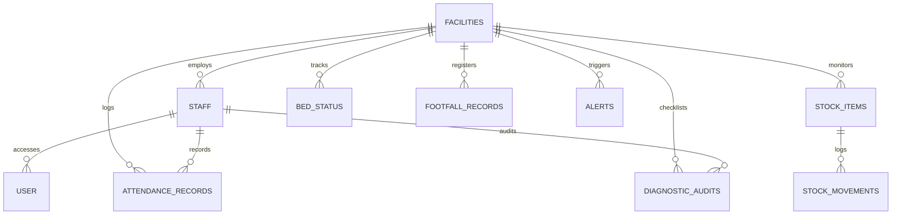

<div align="center">

# 🌟 Swasth AI 🌟
### Predictive Logistics & Resource Oversight Platform for Public Healthcare
**Empowering Rural Health Centers with AI, Real-time Geotargeting, and Offline PWA Support**

[](LICENSE)
[](https://python.org)
[](https://fastapi.tiangolo.com)
[](https://react.dev)
[](https://abdm.gov.in)
[](https://docker.com)

---

[Key Features](#-key-features) • [Tech Stack](#-architecture--technology-stack) • [Database Architecture](#-complete-database-schema) • [AI & Math Engines](#-aiml-core-engines--formulas) • [Quick Start](#-setup--execution-guide) • [Tests](#-unified-integration-verification)

</div>

---

## 📖 Overview

**Swasth AI** is a production-ready, AI-driven public health oversight and resource optimization platform designed for **Primary Health Centres (PHCs)** and **Community Health Centres (CHCs)** in India. 

By integrating directly with standard healthcare frameworks (like the **Ayushman Bharat Digital Mission (ABDM)**, **FHIR R4**, and **Sarvam AI**), Swasth AI bridges operational gaps: preventing drug stockouts, predicting patient footfall surges, tracking clinical rosters with geo-verifications, and optimizing ward beds and diagnostics compliance.

---

## 🚀 Key Features

* 🔮 **AI Stockout Projection:** Time-series seasonal forecasting projecting exactly how many days of inventory remain for vital medicines.
* 📍 **Geotargeted Stock Redistribution:** Automatic generation of drug transfer recommendations from surplus to deficit centers within a $50\text{ km}$ radius using Haversine calculation matrices.
* 📡 **Offline-First PWA:** Frontline clinicians can log movements, diagnostics, and patient footfall offline. Actions are queued and synced automatically when connections resume.
* 🛡️ **Real-time Geofenced Attendance:** Integrated HTML5 geolocation tracking on check-ins to verify roster presence at health centers.
* 📋 **FDSI Diagnostics Audits:** Live tracking of compliance scores based on the National Free Diagnostics Initiative’s mandated test categories.
* 🦠 **Disease Outbreak Hotspot Prediction:** Automated mathematical modeling of 14-day rolling patient footfall logs across blocks, calculating baseline-to-recent ratios, flagging high-risk epidemiological surges, identifying suspect diseases, and outputting targeted containment guidelines for health officers.
* 🗣️ **Multilingual Accessibility:** Native translation interface utilizing Sarvam AI dynamic APIs, supporting English, Hindi, and Tamil language localizations.
* 🔒 **Regulatory Compliance:** Built-in FHIR R4 organization wrappers and DPDP consent trails, access logs, and PII redaction (Right to be Forgotten).

---

## 🏗️ Architecture & Technology Stack

```
                               ┌───────────────┐
                               │ Frontline PWA │
                               └───────┬───────┘
                                       │ (REST API / Offline Queue)
                                       ▼
 ┌────────────────┐          ┌───────────────────┐          ┌───────────────┐
 │ State/District │◄─────────┤ FastAPI Backend   ├─────────►│  Sarvam AI    │
 │ Command Panel  │          │ (Python Engine)   │          │ (Translation) │
 └────────────────┘          └─────────┬─────────┘          └───────────────┘
                                       │
                                       ▼
                             ┌───────────────────┐
                             │ SQLite/PostgreSQL │
                             └───────────────────┘
```

* **Backend Services:** FastAPI (Python 3.10), SQLite/PostgreSQL, SQLAlchemy ORM, Pydantic data validation.
* **AI/ML Engine:** NumPy & Pandas time-series forecasting, least-squares seasonal regression, and greedy spatial optimization.
* **Frontline Client PWA:** React 18, TypeScript, custom styled soothing medical palettes, responsive offline service workers.
* **Administrative Command Center:** React 18, TypeScript, interactive heatmaps, real-time redistribution action controls, and statistical warning indicators.
* **Containerization:** Multi-stage builder `Dockerfile` configurations and unified `docker-compose` stack orchestration.

---

## 🗃️ Complete Database Schema



### Core Entities & Constraints
1. **Facility:** Mapped to unique ABDM HFR IDs (`hfr_id`) with latitude and longitude metrics.
2. **Staff:** Clinicians, pharmacists, and administrators associated with specific facility nodes.
3. **StockItem & Movements:** Tracks quantity adjustments, batches, and safety thresholds.
4. **AttendanceRecord:** Daily check-in/check-out logs measuring active presence with checked-in coordinates (`check_in_lat`, `check_in_lon`).
5. **DiagnosticAudit:** Checklists tracking availability of 10 mandated diagnostics under the National Free Diagnostics Initiative.
6. **Recommendation:** AI-generated medicine transfers from surplus facilities to critical deficit targets.

---

## 🧠 AI/ML Core Engines & Formulas

### 1. Stockout & Footfall Seasonal Forecasting
We employ a seasonal linear regression with daily offsets:
$$\hat{Y}_t = \beta_0 + \beta_1 t + S_{t \pmod 7}$$
* $\beta_0, \beta_1$: Linear trend parameters computed via least squares.
* $S_d$: Weekly seasonal adjustment factors for days of the week (Monday–Sunday).
* **Projected Stockout Date:** Evaluated as:
  $$t_{\text{out}} = \frac{C}{\text{Mean}(\hat{Y}_{t+1}, \dots, \hat{Y}_{t+28})}$$
  Where $C$ is current inventory count, projecting critical calendar warnings.

### 2. Spatial Stock Redistribution Optimizations
Redistribution transfer pairs are matched using a greedy optimizer constrained by spatial distance (Haversine formula):
$$d = 2 R \arcsin\left(\sqrt{\sin^2\left(\frac{\Delta \phi}{2}\right) + \cos(\phi_1)\cos(\phi_2)\sin^2\left(\frac{\Delta \lambda}{2}\right)}\right)$$
* **Deficit Condition:** Days until stockout $t_{\text{out}} < 7$ days.
* **Surplus Condition:** Days until stockout $t_{\text{out}} > 30$ days and quantity exceeds $1.2 \times \text{max\_threshold}$.
* **Distance Bounds:** Maximum transfer radius of $50 \text{ km}$.

### 3. Composite Health Scoring Formula
Every facility is rated from 0 to 100 on a rolling 30-day period:
$$\text{Score} = 0.30 W_{\text{stock}} + 0.25 W_{\text{attendance}} + 0.20 W_{\text{beds}} + 0.15 W_{\text{tests}} + 0.10 W_{\text{completeness}}$$
Where:
* $W_{\text{stock}} = 100 - (\text{Stockouts} \times 15) - (\text{Low Stock} \times 2)$.
* $W_{\text{attendance}} = \frac{\text{Present Records}}{\text{Scheduled Days}} \times 100$.
* $W_{\text{beds}} = 100 - |\text{Mean Occupancy} - 65\%|$.
* $W_{\text{tests}} = \frac{\text{Mandated Tests Available}}{10} \times 100$.
* $W_{\text{completeness}} = \frac{\text{Reporting Days}}{30} \times 100$.

---

## 🚀 Setup & Execution Guide

### Prerequisite Packages
Install Python dependencies:
```bash
pip install -r apps/api/requirements.txt
```

### 1. Database Seeding & Mock Initialization
Seed the SQLite database with 30 days of mock log streams:
```bash
python data/seed/seed.py
```

### 2. Running the Backend Service
Start the FastAPI server locally:
```bash
uvicorn apps.api.main:app --reload --host 0.0.0.0 --port 8000
```

### 3. Running Frontends Locally
Start the React Frontline PWA and Command Dashboard:
```bash
# In apps/web (Frontline PWA - Port 3000)
npm install
npm run dev

# In apps/dashboard (Command Center - Port 3002)
npm install
npm run dev
```

### 4. Deploying via Docker Compose
Package and run the entire microservices cluster:
```bash
docker-compose up --build
```

### 🌐 Live Production Deployments
* **Oversight Command Panel (Dashboard):** [https://swasth-ai-dashboard-dho.vercel.app](https://swasth-ai-dashboard-dho.vercel.app)
* **Frontline Health Center Portal (PWA):** [https://swasth-ai-portal.vercel.app](https://swasth-ai-portal.vercel.app)
* **Serverless REST API (Backend):** [https://api-gamma-pearl.vercel.app](https://api-gamma-pearl.vercel.app)

### ☁️ Cloud Architecture & Serverless Configuration
* **Serverless Backend:** Deployed to Vercel Serverless Functions. Utilizes a `/tmp` writable directory lock bypass to maintain an active SQLite database within ephemeral lambda environments.
* **Auto-Seeding Engine:** Built-in cold-start seeder dynamically populates all necessary database structures (BedStatus, Attendance rosters, Stock, and redistribution suggestions) upon container initialization.
* **Dynamic CORS Whitelisting:** Configured using regex whitelists to securely authorize cross-origin resource queries from all Vercel subdomain configurations.

---

## 🧪 Unified Integration Verification
Run all backend AI, multilingual translations, offline queue syncs, and FHIR/DPDP compliance tests:
```bash
python run_all_tests.py
```
**Verification Suite Outputs:**
```
============================================================
      SWASTH AI - INTEGRATION TEST VERIFICATION SUITE      
============================================================
>>> RUNNING TEST: test_ai_endpoints.py...
   ALL PHASE 3 AI/ML ENDPOINT TESTS PASSED SUCCESSFULLY!

>>> RUNNING TEST: test_translation_offline.py...
   ALL PHASE 4 TRANSLATION & OFFLINE TESTS PASSED SUCCESSFULLY!

>>> RUNNING TEST: test_fhir_dpdp.py...
   ALL PHASE 5 FHIR & DPDP COMPLIANCE TESTS PASSED SUCCESSFULLY!

============================================================
VERIFICATION SUMMARY: 3/3 SUITES PASSED
============================================================
ALL SYSTEMS OPERATIONAL - READY FOR PROVISIONING
```

---

## 📝 License
This project is licensed under the MIT License. See [LICENSE](LICENSE) for details.
